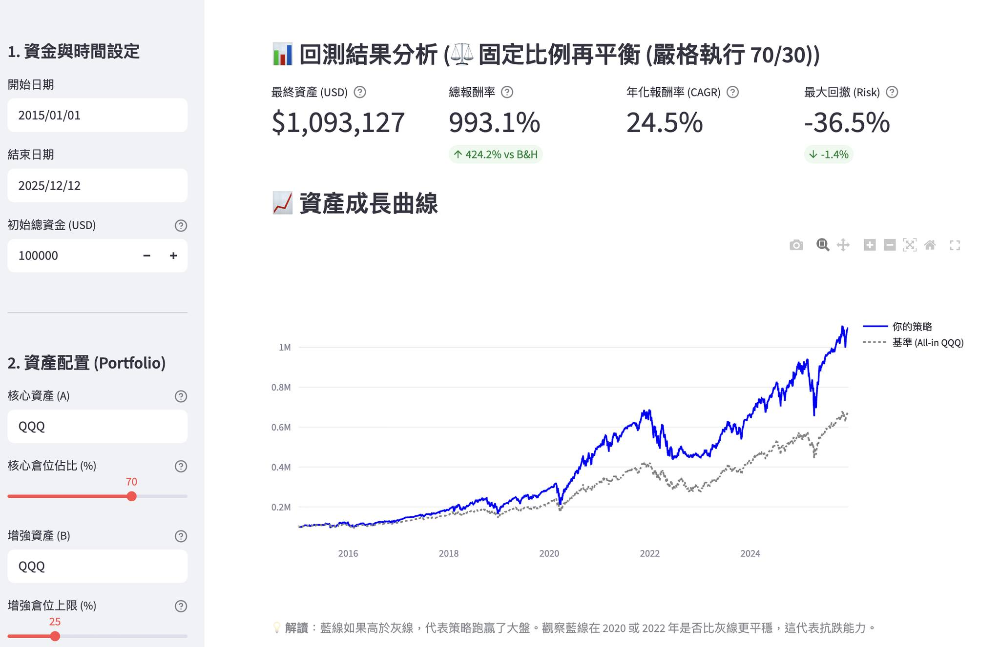
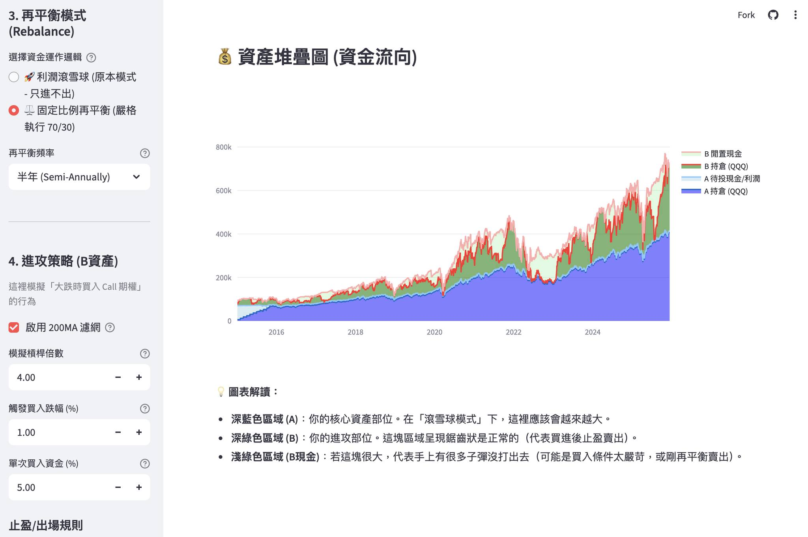

# 🛡️ ETF Core-Satellite Strategy Backtester
# ETF 核心定投 + 增強循環回測系統

[](https://etf-backtest-app.streamlit.app/)
[](https://www.python.org/)
[](https://opensource.org/licenses/MIT)

## 🚀 Demo / 線上試用
**Try the app instantly without installation:** **點擊下方連結立即開始回測：**

👉 **[Launch App (開啟應用程式)](https://etf-backtest-app.streamlit.app/)**

---

## 📖 Introduction / 專案簡介

This is a powerful Quantitative Backtesting tool built with **Python** and **Streamlit**. It is designed to test a hybrid investment strategy that combines **"Long-term Safe Holding" (Core)** with **"Aggressive Dip-Buying" (Satellite)**.

這是一個基於 **Python** 與 **Streamlit** 開發的量化回測工具。旨在測試一種結合**「長期穩健持有」(核心)** 與 **「大跌波段進攻」(增強)** 的混合投資策略。

Users can visualize how different asset allocations (e.g., VOO + QQQ) and rebalancing methods perform against a standard "Buy & Hold" benchmark over historical data.

使用者可以透過視覺化圖表，觀察不同的資產配置（如 VOO + QQQ）與再平衡策略，在歷史數據中與「單純買入持有 (Buy & Hold)」的績效差異。

## 💡 Strategy Logic / 策略邏輯

The strategy divides the portfolio into two parts:
本策略將投資組合分為兩個部分：

### 1. 🛡️ Core Position (核心資產 - ex: VOO)
* **Goal**: Long-term stability and compound interest.
* **Method**: Monthly Dollar-Cost Averaging (DCA).
* **目標**：長期穩健增長，享受複利。
* **方法**：每月定期定額投入。

### 2. 🚀 Satellite Position (增強資產 - ex: QQQ)
* **Goal**: Alpha generation during market corrections.
* **Method**: Simulates "Call Option" leverage (e.g., 4x leverage) or aggressive buying when the price drops below a threshold.
* **Exit**: Take profit in stages based on holding period (0-9 months). Force sell after 9 months.
* **目標**：在市場大跌時進場，獲取超額報酬。
* **方法**：模擬「買權 (Call Option)」的高槓桿效應，設定跌幅觸發買入。
* **出場**：依照持有時間階梯式止盈。超過 9 個月強制平倉。

### 3. 🛡️ Risk Management (風控機制)
* **200 MA Filter**: Stops all buying activities when the price falls below the 200-day Moving Average to avoid bear markets.
* **200 MA 濾網**：當價格跌破 200 日均線（年線）時，停止所有買入動作，避開空頭市場。

---

## 📸 Screenshots / 介面預覽


*策略參數設定與回測結果*


*資產配置資金流向視覺化*

---

## ⚙️ Features / 功能特色

* **Two Rebalancing Modes (兩種再平衡模式)**:
    1.  **Profit Snowball (利潤滾雪球)**: Profits from the Satellite asset are reinvested into the Core asset. (Satellite size remains fixed).
        * *B 資產賺的錢自動轉買 A，極大化 A 的複利。*
    2.  **Fixed Ratio Rebalancing (固定比例再平衡)**: Strictly maintains a 70/30 split. Buy low, sell high automatically.
        * *嚴格執行 70/30 比例，定期賣強買弱。*
* **Interactive Charts (互動式圖表)**:
    * Equity Curve vs Benchmark (資產成長曲線 vs 基準).
    * Drawdown Analysis (水下曲線/回撤分析).
    * Asset Allocation Stacked Area Chart (資產堆疊/資金流向圖).
* **Performance Metrics (關鍵指標)**: CAGR, Max Drawdown, Total Return.

---

## 💻 How to Run Locally / 如何在本地執行

If you want to run this app on your own machine:
如果你想在自己的電腦上運行此程式：

1.  **Clone the repository**
    ```bash
    git clone https://github.com/bullhsu/etf-backtest-app.git
    cd etf-backtest-app
    ```

2.  **Install requirements**
    ```bash
    pip install -r requirements.txt
    ```

3.  **Run the app**
    ```bash
    streamlit run app.py
    ```

---

## 🛠️ Tech Stack / 使用技術

* [Streamlit](https://streamlit.io/) - Web App Framework
* [yfinance](https://pypi.org/project/yfinance/) - Financial Data Source
* [Pandas](https://pandas.pydata.org/) - Data Manipulation
* [Plotly](https://plotly.com/) - Interactive Visualization

---

## 📝 License / 授權

This project is licensed under the MIT License - see the [LICENSE](LICENSE) file for details.
本專案採用 MIT 授權條款，詳情請參閱 LICENSE 文件。

---

## ⚠️ Disclaimer / 免責聲明

This tool is for **educational and research purposes only**. It does not constitute financial advice. Past performance is not indicative of future results.
本工具僅供**教育與研究用途**，不構成任何投資建議。歷史回測數據不代表未來績效，投資請自行評估風險。
