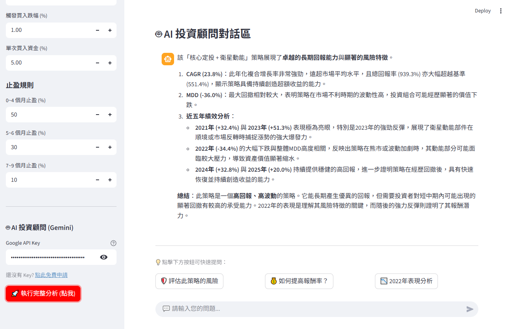

# 🛡️ AI-Powered ETF Core-Satellite Strategy Backtester
# AI 智能投資回測系統：核心定投 + 衛星動能

[](https://etf-backtest-app.streamlit.app/)
[](https://www.python.org/)
[](https://deepmind.google/technologies/gemini/)
[](https://opensource.org/licenses/MIT)

## 🚀 Demo / 線上試用

**Try the app instantly with AI Analysis:** **立即體驗包含 AI 分析功能的完整回測：**

👉 **[Launch App (開啟應用程式)](https://etf-backtest-app.streamlit.app/)**

*(Note: You will need your own Google Gemini API Key to enable the AI features. Getting a key is free!)*
*(注意：您需要輸入自己的 Google Gemini API Key 才能啟用 AI 對話功能，申請 Key 是免費的！)*

---

## 📖 Introduction / 專案簡介

This requires a modern approach to backtesting. Not just numbers, but **Insights**.
這不僅僅是一個回測工具，而是一個擁有 **AI 副駕駛** 的投資分析系統。

This project integrates **Quantitative Finance** with **Generative AI (LLM)**. It tests a hybrid strategy combining **"Core Holding" (Beta)** and **"Satellite Trading" (Alpha)**, while an AI Agent analyzes the results, diagnoses risks, and provides optimization suggestions in real-time.

本專案結合了 **量化金融** 與 **生成式 AI**。除了測試「核心持股 + 衛星交易」的混合策略外，更內建了一位 AI 投資顧問，能即時解讀回測報表、診斷風險，甚至回答您關於「如何提高報酬」或「分析空頭市場表現」的提問。

---

## ✨ New Features / 全新功能

### 🤖 AI Investment Co-pilot (AI 投資副駕駛)
* **Automated Diagnosis**: Automatically generates a performance report (Risk, Profitability, Suggestions) after backtesting.
* **Interactive Q&A**: Chat with the AI about your strategy! Ask questions like *"Why did the drawdown happen in 2022?"*
* **Smart Suggestions**: Quick-action buttons to evaluate risk or optimize parameters.
* **自動化診斷**：回測結束後，AI 自動生成風險評估與參數優化建議。
* **互動式問答**：對數據有疑問？直接在對話框詢問 AI，就像身邊有一位專業分析師。
* **智慧建議**：提供快捷按鈕，一鍵分析風險或獲取優化方向。

### 📊 Advanced Visualization (進階視覺化)
* **Interactive Equity Curves**: Compare your strategy vs. Benchmark (Buy & Hold).
* **Asset Allocation Stacked Chart**: Visualize how funds flow between Core (Safe) and Satellite (Aggressive) assets.
* **互動式權益曲線**：動態比較策略與大盤的績效差異。
* **資產堆疊圖**：清晰呈現核心與衛星資產的資金流向與倉位變化。

---

## 💡 Strategy Logic / 策略邏輯

The strategy divides the portfolio into two parts:
本策略將投資組合分為兩個部分：

### 1. 🛡️ Core Position (核心資產 - ex: VOO)
* **Goal**: Long-term stability.
* **Method**: Monthly Dollar-Cost Averaging (DCA).
* **目標**：長期穩健增長。
* **方法**：每月定期定額投入。

### 2. 🚀 Satellite Position (增強資產 - ex: QQQ)
* **Goal**: Capture Alpha during market dips.
* **Method**: Simulates aggressive buying (or leveraged ETFs/Options) when price drops below a threshold.
* **Exit Rule**: Staged profit-taking (0-9 months). Force sell after 9 months.
* **目標**：市場大跌時進場撿便宜。
* **方法**：跌幅觸發買入，可模擬槓桿操作。
* **出場**：階梯式止盈，超過 9 個月強制平倉。

### 3. 🛡️ Risk Management (風控機制)
* **200 MA Filter**: Stops buying when the price is below the 200-day Moving Average.
* **200 MA 濾網**：跌破年線時停止買入，避開空頭市場。

---

## 📸 Screenshots / 介面預覽


*策略參數設定與回測結果*


*資產配置資金流向視覺化*


*AI諮詢分析生成*

---

## 💻 How to Run Locally / 如何在本地執行

1.  **Clone the repository**
    ```bash
    git clone [https://github.com/bullhsu/etf-backtest-app.git](https://github.com/bullhsu/etf-backtest-app.git)
    cd etf-backtest-app
    ```

2.  **Install requirements**
    ```bash
    pip install -r requirements.txt
    ```

3.  **Get a Free Gemini API Key**
    * Go to [Google AI Studio](https://aistudio.google.com/app/apikey) and create a new API key.
    * 前往 [Google AI Studio](https://aistudio.google.com/app/apikey) 免費申請 API Key。

4.  **Run the app**
    ```bash
    streamlit run app.py
    ```

---

## 🛠️ Tech Stack / 使用技術

* **Frontend**: [Streamlit](https://streamlit.io/)
* **AI Engine**: [Google Gemini API](https://ai.google.dev/) (via `google-generativeai`)
* **Data Source**: [yfinance](https://pypi.org/project/yfinance/)
* **Analysis**: [Pandas](https://pandas.pydata.org/), [NumPy](https://numpy.org/)
* **Visualization**: [Plotly](https://plotly.com/)

---

## ⚠️ Disclaimer / 免責聲明

This tool is for **educational and research purposes only**. It does not constitute financial advice. The AI analysis is generated by a Language Model and may contain errors.
本工具僅供**教育與研究用途**，不構成任何投資建議。AI 分析結果由語言模型生成，可能存在誤差，投資請自行評估風險。
